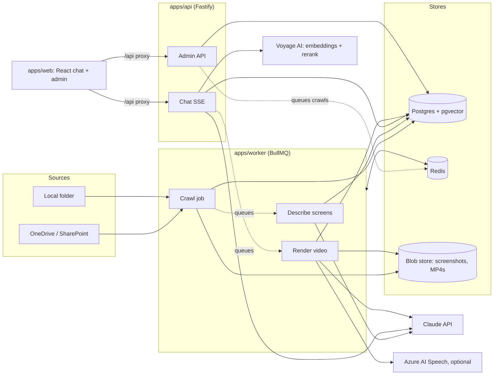

# Architecture

This describes how the Onboarding Assistant works today, as built. For setup see [DEVELOPMENT.md](DEVELOPMENT.md). For what is finished and what is left, see [STATUS.md](STATUS.md).

## 1. What the system does

New users and new developers ask questions in a chat. The assistant answers **only** from the organisation's Use Case Specifications (UCS) and UI Specifications (UIS):

| Question type | Example | Response |
|---|---|---|
| UI how-to (`ui_howto`) | "How can I monitor my submission record counts and reprocess failed ones?" | Numbered steps with citations, plus a short MP4 guide built from UIS screenshots with the relevant element highlighted |
| Explanation (`explain`) | "How is the property tax building address hierarchy managed?" | A detailed answer (developer or end-user style) with numbered citations linking to the source documents |
| Out of scope, or not in the documents | "What is the capital of France?" | A fixed refusal message. No model writes it. |

The core rule is that **the assistant never answers from the model's general knowledge.** Grounding is enforced in code (see section 5), not only in the prompt.

## 2. Components



| Package / app | Responsibility | Key files |
|---|---|---|
| `packages/shared` | Zod schemas, types, settings defaults, env access | `types.ts` (SourceConfig, AssistantSettings, ScreenDescription), `config.ts` |
| `packages/db` | Drizzle schema, migrations, client | `schema.ts`, `migrations/*.sql`, `migrate.ts` |
| `packages/ingestion` | Connectors, parsing, chunking, classification, embeddings, indexing | `onedrive.ts`, `local.ts`, `parsers/docx.ts`, `chunker.ts`, `classify.ts`, `indexer.ts` |
| `packages/agents` | Retrieval, Claude calls, grounding, chat pipeline, tracing and cost, settings | `retrieval.ts`, `models.ts`, `grounding.ts`, `pipeline.ts`, `trace.ts`, `settings.ts` |
| `packages/video` | Frame drawing, TTS, MP4 assembly | `frame.ts`, `tts.ts`, `render.ts` |
| `apps/worker` | Background jobs and schedules | `crawl.ts`, `media.ts`, `schedulers.ts`, `queue.ts`, `main.ts` |
| `apps/api` | HTTP API: auth, chat, admin | `auth.ts`, `chat.ts`, `admin.ts`, `admin-ai.ts`, `server.ts`, `main.ts` |
| `apps/web` | React SPA (Vite): chat and admin pages | `pages/Chat.tsx`, `pages/admin/*`, `api.ts`, `auth.ts` |

**Tech stack:**
- Node.js 24 with TypeScript (ESM), npm workspaces
- Fastify 5, BullMQ with Redis, Drizzle ORM on Postgres 17 with pgvector
- Anthropic TypeScript SDK; Voyage AI (`voyage-3.5`, `rerank-2.5`)
- sharp and FFmpeg (via `ffmpeg-static`) for video
- React 19 with Vite 7; MSAL for browser sign-in

## 3. Ingestion: keeping the knowledge base in sync

### 3.1 Connectors
The `SourceConnector` interface (`packages/ingestion/src/connector.ts`) has three methods: `listChanges(cursor)`, `download(id)` and `getAcl(id)`.

| Connector | Change detection | Status |
|---|---|---|
| `OneDriveConnector` | Graph **delta API** from the drive root; the cursor is the `deltaLink`. App-only auth. Handles 429 `Retry-After`. | Unit-tested; not yet run against a real tenant (see STATUS) |
| `LocalFolderConnector` | Walks the folder; the cursor is a JSON snapshot of `size-mtime` per file. A rename shows as delete plus add. Only folders under `LOCAL_SOURCE_ROOTS` are allowed. | Used for the current demo |

`createConnector()` in `connectors.ts` picks the connector from `sources.connector`. To add Google Drive, implement the interface and add a case there.

### 3.2 Crawl job (`apps/worker/src/crawl.ts`)
**Triggers.** All four go into the BullMQ `crawl` queue:

| Trigger | Schedule |
|---|---|
| Scheduled delta | `deltaCron`, default every 30 minutes |
| Full reconciliation | `fullCron`, default 02:00 |
| Manual | Admin buttons |
| Webhook | Planned, not built |

Schedulers are kept in sync with the `sources` table by `syncSchedulers()`. A Redis lock (`crawl-lock:<sourceId>`) makes sure only one crawl runs per source at a time.

**What happens to each changed item:**

| Situation | Action |
|---|---|
| Deleted, or now outside the folder, globs or file types | Soft delete: chunks and screens are removed, the document row is kept with `deleted_at` |
| Same content (`cTag`), same path, current parser | ACL refresh only |
| New or changed content, renamed, or read by an older `PARSER_VERSION` | Download, then `indexDocument()` |
| Fails 5 times (backoff 2s, 4s, …) | Dead-lettered (`crawl_items.status = 'dead'`) and the run continues |

**Guarantees:**
- The delta cursor is saved only after a run **succeeds**. If a run crashes, the same changes are replayed next time, and every step is idempotent.
- A **full** run soft-deletes documents the source no longer lists.
- After the listing, up to 50 documents left from an older `PARSER_VERSION` are re-read in each run, because a delta never reports unchanged files.

### 3.3 Indexing (`packages/ingestion/src/indexer.ts`)
1. **Parse.** For `.docx`: mammoth converts to HTML, then `htmlToDocument()` splits it into sections. A section starts at a Word heading, or at a **bold numbered paragraph** ("3. LAYOUT GRID", "4.2 Filters"). Images stay with the section they appear in. Table cells keep their line breaks, and page footers are removed. For `.pdf`: pdfjs extracts text only and splits it on known UCS headings.
2. **Classify.**
   - Document type: the document's own title or header ("UI Specification…", "Use Case Specification…") **wins over** the folder rules. Folder rules are the fallback.
   - UC ID: taken from the file path with `ucIdPattern`, falling back to the document header.
   - An admin override (`uc_id_override`, `doc_type_override`) beats both.
3. **Chunk.**
   - Sections are mapped to canonical UCS names where possible (Main Flow, Business Rules, …). Text before the first heading becomes "Document Info".
   - Chunks are up to 3,000 characters, split on paragraphs with a one-paragraph overlap.
   - Each chunk's text hash includes a context header (`UC-045 | UIS | heading path`).
4. **Embed** only chunks whose hash is new, using Voyage `voyage-3.5` (1024 dimensions).
5. **Screenshots.** Each image is stored in the blob store under its SHA-256. If the hash is unchanged, the earlier vision description, boxes and `verified` flag are kept.
6. **Swap in one transaction.** Delete and insert the chunks and screens, update the document (version + 1, `parser_version`), rebuild `uc_links` (UCS ↔ UIS by UC ID), and mark video jobs built from this document as `stale`.

### 3.4 Screenshot descriptions (`apps/worker/src/media.ts` → `describeScreens`)
This runs after every crawl or reindex for screens with no description.
- The image is scaled down to a 1568 px long edge.
- Claude (vision model from Settings) returns `{screenName, purpose, navigationPath, uiElements: [{label, type, box: [x, y, w, h] as 0–1 fractions]}]}`, which is embedded and stored.
- Failures are saved in `describe_error` so they aren't retried forever. Authentication errors stop the job instead of marking screens failed.
- Admins can correct boxes and mark screens verified on the **Screens** page.

## 4. Answering a question (`packages/agents/src/pipeline.ts` → `handleQuestion`)

```mermaid
sequenceDiagram
  participant U as User (web)
  participant A as API /chat (SSE)
  participant R as Router (Claude Haiku 4.5)
  participant S as Retriever
  participant M as Answer (Claude Opus 5.5, citations)
  participant V as Verifier (Claude Haiku 4.5)
  U->>A: question
  A->>A: budget check (stop if over limit)
  A->>R: classify + rewrite
  alt out_of_scope
    A-->>U: fixed refusal
  end
  A->>S: hybrid search + rerank
  alt best relevance < minRelevance
    A-->>U: fixed refusal (answer model not called)
  end
  A->>M: question + retrieved sections as cited documents
  M-->>A: text blocks with citations
  A->>A: drop uncited sentences, check quotes verbatim
  A->>V: claims + quotes
  V-->>A: supported / not supported
  A->>A: drop unsupported; refuse if too much removed
  A-->>U: grounded answer + sources (only now)
  opt ui_howto
    A->>A: create or reuse video job, queue it
    A-->>U: video job id (UI polls status)
  end
```

**Retrieval** (`retrieval.ts`):
- Three candidate lists, merged with reciprocal rank fusion (k = 60):
  - pgvector cosine search (top 30)
  - Postgres full-text search (`websearch_to_tsquery`, top 30)
  - chunks from UC IDs the router named (top 10)
- The fused list is reranked with Voyage `rerank-2.5`. Scores are 0–1, and the scope gate uses them.
- With `ACL_TRIMMING=true`, only documents with an empty ACL, or one shared with the user or their groups, are searched.

**Routing** uses structured output (Zod via `zodOutputFormat`) and returns `{intent, audience, ucHints, rewrittenQuery, reason}`. `clarify` is currently treated as `explain`. The conversation history is used **only** to rewrite the query; it is never a source of facts.

**Models** (`models.ts`). All model choices are admin settings:

| Role | Default |
|---|---|
| Router | `claude-haiku-4-5` |
| Answer | `claude-opus-5-5`, effort `medium` |
| Verifier | `claude-haiku-4-5` |
| Vision | `claude-opus-5-5` |
| Storyboard | `claude-opus-5-5` |

- The answer call sends each retrieved chunk as a `document` block with `citations: {enabled: true}`.
- On Opus 5.x, Sonnet 5.5 and Fable 5.x models it adds the server-side refusal fallback (`betas: ["server-side-fallback-2026-07-01"], fallbacks: "default"`).
- Effort is not sent to Haiku.

## 5. Grounding rules (`packages/agents/src/grounding.ts`)

| # | Check | Implemented in | If it fails |
|---|---|---|---|
| 1 | Router says `out_of_scope` | pipeline | Fixed refusal; no retrieval |
| 2 | Scope gate: at least `minChunks` sections with rerank score ≥ `minRelevance` (defaults 1 and 0.35) | pipeline | Fixed refusal; **answer model not called** |
| 3 | The answer model sees only retrieved sections; the prompt forbids outside knowledge; gaps must start with "Not covered in the documentation:" | models.ts prompt | n/a |
| 4 | Every non-formatting text block must carry a citation (`isConnective` allows list markers, headings and short lead-ins, checked line by line) | groundAnswer | Block removed (`uncited`) |
| 5 | Every `cited_text` must appear verbatim (whitespace-normalised) in the stored chunk | groundAnswer (string match) | Claim removed (`quote_mismatch`) |
| 6 | An independent verifier judges each claim against its quotes; a missing verdict counts as unsupported | groundAnswer + verifier model | Claim removed (`not_supported`) |
| 7 | Removed share > `maxRemovedRatio` (0.3), or nothing left | groundAnswer | Fixed refusal |
| 8 | The answer is sent to the browser only after steps 1–7 | chat route | n/a |

The outcome is `answered`, `partial` (something removed, or a gap was stated) or `refused`. The verified claims are stored as `steps` in the message payload, so a video can be made from them later.

### Video grounding (`runVideoJob`)
1. The storyboard model receives **only** the verified steps and the described screenshots of the UCs involved.
2. Code then validates every scene:
   - Unknown `screenId` → text card.
   - Element label not in that screen's description → no highlight.
   - Scene with no valid step IDs → dropped.
3. The narration is checked against the quotes of its steps. If it isn't supported (or `narrationMode = extractive`), the verified step text is used instead.

## 6. Video rendering (`packages/video`)

| Step | Implementation |
|---|---|
| Frame | sharp composes a 1920×1080 PNG: the screenshot fitted above a 200 px caption bar; the highlight dims everything except the element box; the caption is the narration text |
| Speech | `AzureTts` (REST, `riff-24khz-16bit-mono-pcm`), or `SilentTts` (silent WAV, length based on word count) when no key is set |
| Assembly | FFmpeg: one H.264/AAC segment per scene, still frame held for the audio length + 0.6 s, then concat demuxer with `-c copy` and `+faststart` |
| Caching | `video_jobs.cache_key` = hash of (rewritten query, step texts, document versions). Reused unless `failed` or `stale` |

## 7. Data model (17 tables)

| Area | Tables |
|---|---|
| Sources and crawl | `sources`, `crawl_runs`, `crawl_items` |
| Knowledge base | `documents`, `chunks` (vector(1024) HNSW index, generated `tsvector` with GIN index), `screens` (description JSON, vector), `uc_links` |
| Chat | `conversations`, `messages` (payload: sources, intent, steps, videoJobId), `feedback` |
| Video | `video_jobs` |
| Observability | `traces`, `spans`, `llm_calls`, `model_prices` |
| Admin | `settings` (versioned JSON, one active), `audit_log` |

Migrations are in `packages/db/migrations`. `0002` also seeds `model_prices`.

## 8. Security

**Authentication.** The API validates Entra ID access tokens with `jose` against the tenant JWKS, checking issuer, audience (`API_AUDIENCE` or client ID) and expiry.

**Roles.** Access is enforced in the API on every route:

| Role | Can do |
|---|---|
| `Assistant.User` | Chat |
| `Assistant.Developer` | Chat, with developer-style answers by default |
| `Assistant.ContentReviewer` | Read admin pages; manage documents and screens |
| `Assistant.Admin` | Everything, including sources, settings, prices, playground and audit |

**Privacy and secrets:**
- Users can only see their own conversations and messages; other users get a 404.
- Secrets come only from the environment (Key Vault in production). `/admin/secrets/status` reports whether each is set, never its value.
- Every admin change is written to `audit_log` with before/after values and the IP address. Viewing a trace is audited too.

**Safeguards:**
- **Dev bypass.** `AUTH_DEV_ROLES` makes every token a local user with those roles. The API refuses to start with it when `NODE_ENV=production`.
- **Local folders.** Sources are restricted to `LOCAL_SOURCE_ROOTS`, and path traversal is blocked.
- **Document trimming.** `ACL_TRIMMING` is off by default (see STATUS).

## 9. Observability and cost
- **Traces.** Every chat question, video render, screenshot-description batch and video request creates a `trace`.
- **Spans.** Each pipeline step writes a `span` with the decisions it made:

  | Span | What it records |
  |---|---|
  | budget | Spend so far against the limits |
  | router | Intent, audience, rewritten query, reason |
  | retrieval | Candidates and scores |
  | scope_gate | Passed or refused, and why |
  | answer | Model, blocks, cited blocks |
  | grounding | Kept and removed claims, with reasons |
  | video_job | New job or cache hit |
  | storyboard / video_grounding / render | Scene planning, scene validation, render result |

  Only the router and verifier write a one-line `reason`; the model's internal reasoning is never stored.
- **Calls.** Every model or API call writes an `llm_calls` row: input, output, cache-read and cache-write tokens, units (TTS characters), latency, stop reason, error and cost. Cost uses `model_prices`, which admins can edit.
- **Budgets.** Daily, monthly and per-user-daily limits are checked before any model call. The admin UI shows a banner at 80% and 100%.

## 10. Design decisions (and differences from the original plan)

| Decision | Reason |
|---|---|
| One answer call over code-run retrieval, instead of a tool-using agent loop | Simpler and easier to ground: the model can't fetch anything new, and every input is known and logged |
| Answer not streamed token by token | Text must pass grounding before the user sees it; the UI shows step-by-step status instead |
| Document type from content first | The sample set had a UI spec saved in the UCS folder |
| `PARSER_VERSION` | Parser fixes must reach documents whose files haven't changed |
| Local folder connector | The personal Azure tenant has no SharePoint; used for the demo until the company tenant is available |
| Vite + React instead of Next.js | A plain SPA with MSAL bearer tokens; no server rendering needed |
| npm workspaces instead of pnpm | No extra global tooling |
| Postgres for traces (no Langfuse yet) | One store; the admin UI reads it directly |
